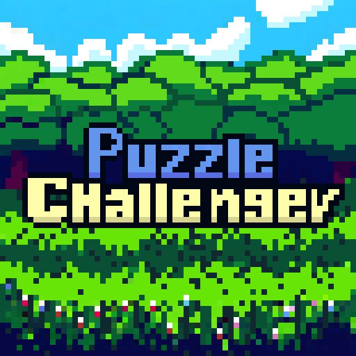
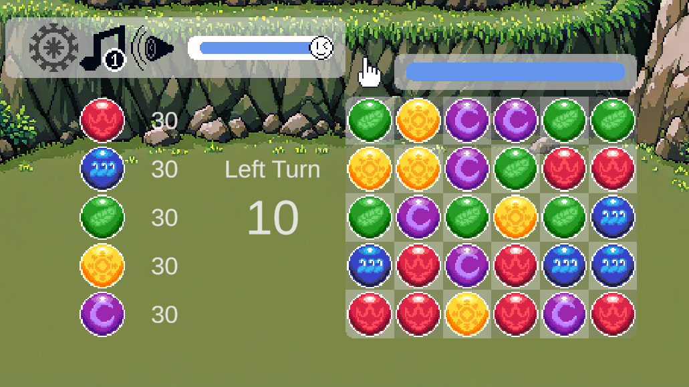
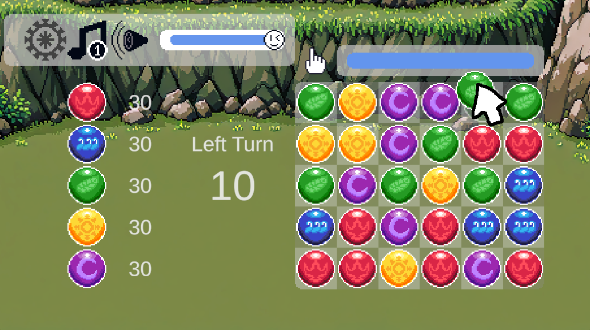
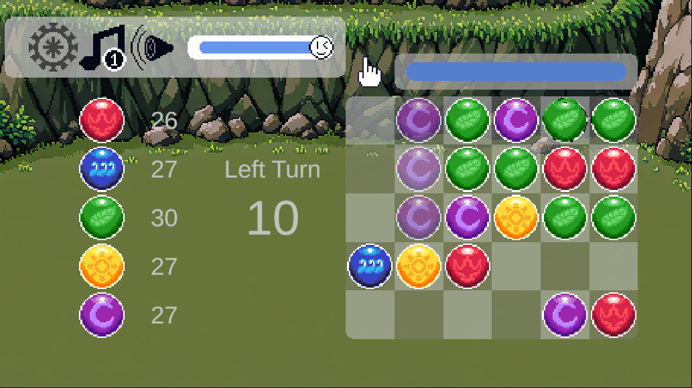

    

# 멋쟁이 사자처럼 Unity 2기 1차 개인 프로젝트
> 멋쟁이 사자처럼 Unity 2기 1차 개인 프로젝트.   
2주일 정도의 기간으로 혼자 만들 수 있는 간단한 게임을 만들어보자!

    

## 목차
 - [개요](#개요)
    - [제목](#제목)
    - [장르](#장르)
    - [타겟](#타겟)
    - [그래픽 컨셉](#그래픽-컨셉)
 - [기획 의도](#기획-의도)
	- [의도](#내-인생-최고의-게임)
	- [플레이 목표](#플레이-목표)
	- [차별성](#차별성)
 - [플레이 요소](#플레이-요소)
     - [핵심 매커니즘](#퍼즐-매커니즘)
     - [플레이 흐름](#플레이-흐름)
 - [기능 명세서](#기능-명세서)
    - [오브젝트 풀](#오브젝트-풀)
    - [마우스 따라오기](#마우스-따라오기)
    - [퍼즐 교환](#퍼즐-교환)
    - [상태 관리](#상태-관리)
 - [발전 가능성](#발전-가능성)
    - [스테이지 또는 난이도](#스테이지-또는-난이도)
    - [진행 방식](#진행-방식)
    - [조작감](#조작감)
    - [다양한 플레이 경험](#다양한-플레이-경험)

 

## 실행하기
https://ilot12.github.io/PuzzleChallenger/     
GH page를 이용해 실행할 수 있도록 만들어 놓았습니다.     
 
   

## 개요

### 제목
이 게임은 제가 11년차 퍼즐앤드래곤 고인물로서,   
다른 사람들에게는 퍼즐앤드래곤 방식의 퍼즐에 대한 도전이면서   
제가 이 방식의 퍼즐에서 챌린저급 실력자라는 뜻을 살려 이름을 지었습니다.   

### 장르
이 게임은 퍼즐앤드래곤 방식의 퍼즐을 맞추는   
난이도가 높고 고민을 많이 해야하는 발전된 Match3장르입니다.

### 타겟
장르 특성상 플레이 한 번에 고민을 많이하는 유저를 목표로 하고있습니다.   
따라서 턴제 게임에 익숙한 사람들을 목표로 하고있습니다.

### 그래픽 컨셉
단순한 개인 취향으로 도트를 선택했습니다.   
배경화면을 제외한 현재 웹 빌드 버전까지의 도트는 모두 직접 찍었습니다.   
픽셀 사이즈는 중대사항입니다.
   
       
	
## 기획 의도

### 내 인생 최고의 게임
제가 퍼즐앤드래곤이라는 게임을 하면서   
모바일로 할 수 있는 조작중 가장 재미있는 조작을 가진 게임이라고 생각했습니다.    
저에게 최고였던 이 경험을, 내가 고민하고 즐겼던 그 경험을 나눠주고 싶습니다.   

### 플레이 목표
일반 Match3 퍼즐과 다르게 최선의 수를 찾아내기 위해 깊은 시간 고민해야 합니다.   
또 고민을 오래한다고 해도 그에 따라 조작을 성공적으로 수행해야합니다.   
경로에 대한 오랜 고민과 생각    
이를 수행할 수 있는 피지컬   
움직일 때마다 연속적으로 바뀌는 퍼즐에 대해 순식간에 생각해야 하는 순발력까지   
제가 즐겼던 이 세가지를 모두 즐기시길 바랍니다.   

### 차별성
이 퍼즐 방법을 적용해 다른 Match3 퍼즐 게임처럼 캐주얼하게 만들고 싶습니다.     
난이도가 높은 퍼즐요소와 진입하기 어려운 RPG요소가 합쳐지고   
게임이 2012년부터 오래 장수하면서 접근하기 어려워 진 것이 사실입니다.   
저는 이를 캐주얼한 진행과 적절한 난이도 조절로   
모두가 이 방식의 퍼즐을 즐기고 익숙해질 수 있도록 하고싶습니다.

## 게임 플레이

### 퍼즐 메커니즘
위 이미지는 제가 구현한 게임의 플레이 사진입니다.

제 게임의 핵심 요소인 퍼즐을 맞추는 요소는 퍼즐앤드래곤이라는 게임에서 가져왔습니다.   
구성 요소는 Match3게임과 비슷하지만   
퍼즐의 이동에 단 1번 이동이라는 제한대신 마음껏 이동이 가능하고 시간이 제한되어 있습니다.   
그렇다고 드래그 드롭을 여러번 하는 것은 아니고 단 한번의 드래그 드롭 안에 최대한 많은 것을 맞춰야 합니다.   

### 플레이 흐름

#### 대기

    

대기 상태입니다.   
퍼즐의 상태를 시간 제한 없이 확인할 수 있습니다.
클릭으로 퍼즐을 집어들고 끌고다닐 수 있는데,   
퍼즐끼리 교환이 일어나지 않는다면 시간이 줄어들지 않습니다.   
대기 상태가 아니라면 퍼즐을 아무리 클릭해도 반응하지 않습니다.   

#### 맞추기

    

퍼즐을 들어 퍼즐끼리 최초로 위치가 바뀌었다면 위에 손가락 그림 옆의 시간이 흐르기 시작합니다.   
시간 내로 마음껏 이동은 가능하나 클릭을 떼면 다음으로 넘어갑니다.   
시간이 다 되면 클릭을 떼기 전까지 다음으로 넘어가지 않습니다.   
시간이 다 되면 조작이 불가능한 상태이므로 클릭을 떼 다음으로 넘어가면 됩니다.   

#### 계산
클릭을 떼거나 시간이 모두 지난 후 클릭을 떼면 계산 단계로 진입합니다.   
맞춘 퍼즐들이 순차적으로 사라지며 맞춘 퍼즐에 대한 처리를 합니다.
   

    

#### 지우기
한 줄로 3개 이상 맞은 퍼즐끼리 지워집니다.   
L자 T자등 여러 모양에 대해서도 잘 작동합니다.   
지워지고 난 뒤 새로운 퍼즐들이 떨어집니다.   
이 때, 떨어지며 자연스럽게 맞은 퍼즐들은 남은 이동 횟수를 차감하지 않고 마저 맞춰집니다.   
이를 반복하여 더 이상 맞은 퍼즐이 없을 때 대기 상태로 돌아옵니다.   

## 기능 명세서

### 오브젝트 풀
6 X 5의 크기의 퍼즐판에서 퍼즐이 계속해서 생성되고 삭제되기 때문에   
퍼즐 오브젝트가 계속해서 생성되고 사라져야 합니다.   
따라서 오브젝트 풀을 적용했습니다.

### 마우스 이벤트
들고있는 퍼즐에 대해 마우스를 따라오도록 만들었습니다.   
이 때, 퍼즐앤드래곤과 최대한 비슷한 조작감을 
위해 마우스 위치로 바로 이동하는 것 대신 살짝 느리게 따라오게 하고 싶었습니다.    
따라서 드래그 이벤트에 마우스와 원래 위치 사이의 3:7내분점으로 이동하도록 구현했습니다.   
또한 퍼즐판 바깥을 움직일 때도 멈추는 대신 넘어가지 않은 좌표만 따라오도록 구현했습니다.   

### 퍼즐 교환
들고 있는 퍼즐이 인접한 퍼즐과 부딪히면 자리를 바꿉니다.
이를 구현하기 위해 마우스가 퍼즐판 바깥에서 움직일 때도 퍼즐끼리 부딪히면 교환되도록 충돌을 이용해 구현했습니다.   
따라서 원래 게임과 마찬가지로 대각선 이동도 가능합니다.
제가 느꼈던 경험을 그대로 전해드리기 위해 최대한 비슷하게 구현했습니다.   

### 상태 관리
대기 상태   
퍼즐을 움직이는 상태   
맞추고 계산을 기다리는 상태    
퍼즐이 지워지며 계산되는 상태   
비워진 퍼즐이 채워지는 상태 등   
현재 게임 상태를 구분하도록 하여 오류 없이 동작하도록 구현했습니다.   

## 발전 가능성

### 스테이지 또는 난이도
현재는 단순한 게임판 하나로 현재 스테이지를 깨느냐 못깨느냐만 구현되어 있습니다.   
목표는 여러개의 스테이지를 만들어    
초심자부터 전문가까지 즐길 수 있도록 난이도를 다양하게 만들고 싶습니다.   

### 진행 방식
지금은 캐주얼한 게임을 목표로 삼기에 다른 Match3 게임과 같이   
계속해서 스테이지를 깨 나가는 방식으로 만들 예정입니다.   
나중에는 제가 가장 좋아하는 장르인 턴제 로그라이크와 엮고 싶습니다.   
이 때는 어려운 장르와 어려운 장르의 혼합이니 만큼   
최대한 난이도를 고려해 마찬가지로 초심자부터 전문가까지 즐길 수 있도록 만들고 싶습니다.   

### 다양한 플레이 경험
지금 퍼즐을 맞추는 방식은 처음에는 이 자체로 정말 재미있지만   
외부 방해요소가 없다면 이에 익숙해지고 지루해질 수 있습니다.     
퍼즐앤드래곤 고인물로서 여러가지 기믹들을 활용해   
유저를 괴롭히고 즐거운 고민에 빠지게 할 방법을 잘 알고있습니다.   
이를 활용하고 응용해 재미있는 기믹을 추가하고 싶습니다.   